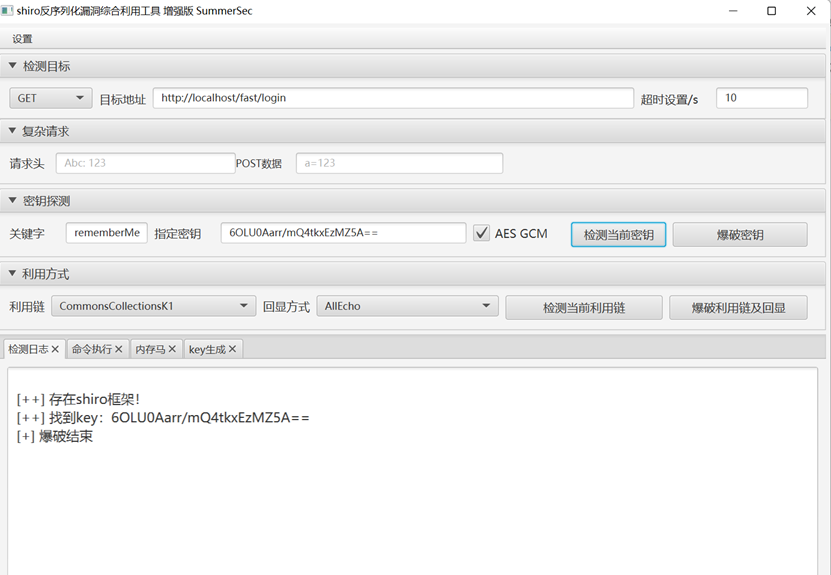
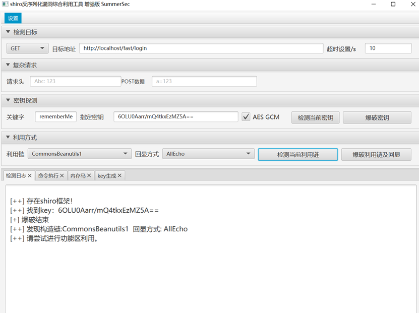
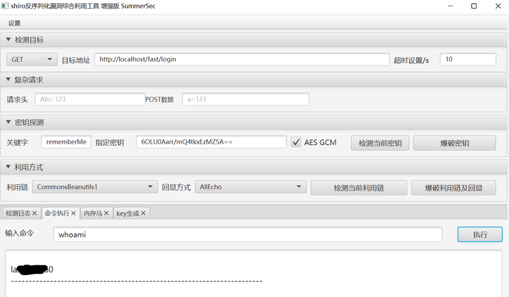

# CVE-2024-45943

## Vulnerability Analysis

After the code deployment, configuration information can be found under the `fast-admin\src\main\resources` directory. This includes the `shiro.rememberMe.cipherKey` field, which contains the system's Shiro key. The field's value is `6OLU0Aarr/mQ4tkxEzMZ5A==`.

This situation can lead to vulnerabilities similar to Shiro-550, potentially resulting in remote code execution (RCE). The Shiro-550 vulnerability arises when the AES encryption key is hard-coded into the source code, allowing attackers to craft malicious `rememberMe` cookies that the system will deserialize, leading to code execution. If the `shiro.rememberMe.cipherKey` field in your configuration is set to a default or hard-coded key, it may expose the system to similar risks.

## Vulnerability Reproduction

After setting up the environment, use the ShiroAttack2 tool, which can be found [Releases · SummerSec/ShiroAttack2 (github.com)](https://github.com/SummerSec/ShiroAttack2/releases). Enter the URL information, such as `http://localhost/fast/login` or `http://localhost:8080/fast/login` (depending on the port used during setup). For the key field, input `6OLU0Aarr/mQ4tkxEzMZ5A==`, check the AES-GCM option, and click 检测当前密钥(means 'Check current key'). If the screen appears as shown in the image below, it indicates the vulnerability is present.

Select the CB1 chain(CommonsBeautils1) for the exploitation chain, choose 'AllEcho' as the echo method, and click 检测当前利用链(means 'Check the current exploitation chain'). If the screen appears as shown in the image below, it indicates that the vulnerability can be exploited.

Finally, use the 命令执行(means command execution) module and run the `whoami` command to prove the vulnerability is exploitable.

